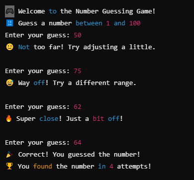

# 🎮 C Number Guessing Game  

A fun number guessing game built in **C!** The program generates a random number, and you have to guess it. The game gives **AI-style hints** to help you! 🔥  

## 📌 Features  
✅ Random number between 1-100  
✅ AI-style hints (like "Super close!" or "Way off!")  
✅ Simple and fun terminal-based game  

## 🚀 How to Play  
1. **Download the code** (`guessing_game.c`).  
2. Open a **terminal** or **command prompt**.  
3. Compile the code using:  
4. Run the game:  
5. Start guessing the number and enjoy! 🎯  

## 💡 Want More Cool C Projects?  
Follow me on **GitHub** and drop a ⭐ if you like this! 🚀  
## 🖼️ Screenshot

